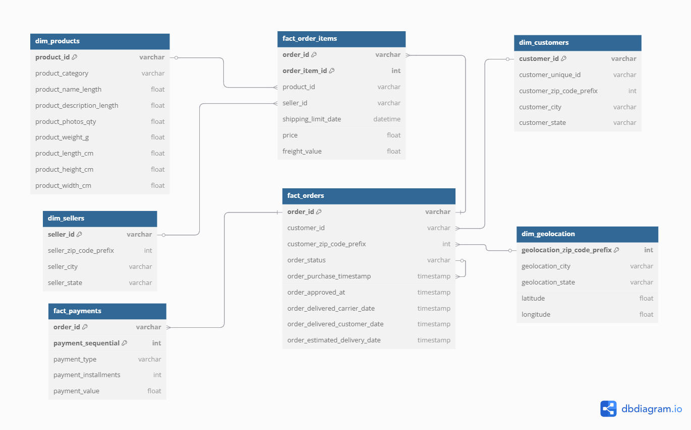

# 🛒 Ecommerce Sales Insights SQL

## 📈 Project Overview

This project centers around analyzing a comprehensive e-commerce dataset using **SQL** and **Python** to extract meaningful business insights. It integrates data modeling, analytical querying, and visualization to enable informed decision-making across various aspects of online retail operations.

### 🔍 Key Objectives

- ✅ Design and implement a relational database using **PostgreSQL**
- ✅ Clean and explore data with **Python (pandas, seaborn, matplotlib)**
- ✅ Solve real-world business problems using **SQL queries**
- ✅ Visualize key trends and metrics through **EDA & KPIs**
- ✅ Create a comprehensive **Entity-Relationship Diagram (ERD)** to understand the data schema
---

## 📁 Folder Structure

<details>
<summary>📁 Click to view full folder structure</summary>

```text
Ecommerce_Sales_Insights_SQL/
│
├── datasets/
│   ├── Raw_data/                # Contains original raw CSV files
│   └── cleaned_data/           #  Cleaned and preprocessed data used for analysis
│
├── notebooks/
│   ├── E-Commerce_data_cleaning.ipynb          # Data cleaning notebook
│   ├── EDA_analysis_visualizations.ipynb       # Basic EDA Functionality and EDA graphs using seaborn & matplotlib
│   └── run_sql_queries_and_export_results.ipynb # Run SQL queries & export results

│
├── SQL_Database/
│   ├── Defining_the_Tables.sql      # PostgreSQL schema
│   └── load_cleaned_data.py         # Script to load data into PostgreSQL
│
├── bussiness_queries_result/
│   ├── query_01_top_sellers.sql
│   ├── ...
│   └── query_20_delivery_performance.sql        # Finalized SQL queries
│   ├── query_01_result_top_sellers.csv          # pgAdmin CSV outputs
│   └── query_20_result_delivery_performance.csv
│
├── outputs/
│   ├── query_results/                # Results exported via Python
│   │   ├── query_01_top_sellers_result.csv
│   │   └── ...
│   └── eda_missing_summary/         # Tabular summaries from EDA
│
├── diagrams/
│   └── ERD_E-Commerce.png
│
└── README.md
```
</details> 
---

## 🧭 Step-by-Step Process

### ✅ Step 1: Data Cleaning (`E-Commerce_data_cleaning.ipynb`)
- Loaded raw e-commerce datasets.
- Handled missing values, fixed data types.
- Exported cleaned datasets to the `datasets/cleaned_data/` folder.


### 📊 Step 2: Exploratory Data Analysis (`EDA_analysis_visualizations.ipynb`)
- Performed initial data exploration using `pandas` to understand distributions and missing values.
- Created visualizations using `matplotlib` and `seaborn`, including:
  - Histograms, boxplots, pie charts
  - Count plots, bar plots
- Insights gathered on product weight, price distribution, regional customer trends, and more.


### 🛠️ Step 3: PostgreSQL Database Setup
- Defined schema using `Defining_the_Tables.sql`, including:
  - 4 dimension tables: `dim_customers`, `dim_geolocation`, `dim_products`, `dim_sellers`
  - 3 fact tables: `fact_orders`, `fact_order_items`, `fact_payments`
- Created relationships using foreign keys to support star schema.
- Used `load_cleaned_data.py` to insert cleaned data into PostgreSQL using SQLAlchemy.


### 📌 Step 4: Business Problem KPIs (20 Queries)
Each business problem was solved using SQL and results were exported both from pgAdmin and Python.
Click on the links below to view the SQL queries and their corresponding outputs:
#### ✅ KPI 1: Top 10 Best-Selling Products  
🎯 Goal: Determine which products generate the most revenue and are sold most frequently.    
📄 SQL Query: [query_01_top_sellers.sql](bussiness_queries_results/01_top_selling_products.sql)  
📊 pgAdmin Result:[query_02_result_top_sellers.csv](bussiness_queries_results/01_result_top_selling_products.csv)  
🐍 Python Result:[query_02_result_top_sellers.csv](outputs/query_results/01_top_selling_products_result.csv)

#### ✅ KPI 2: Revenue by Product Category  
🎯 Goal: Understand which product categories are generating the most revenue.  
📄 SQL Query: [query_02_revenue_by_category.sql](bussiness_queries_results/02_revenue_by_category.sql)  
📊 pgAdmin Result: [query_02_result_revenue_by_category.csv](bussiness_queries_results/02_result_revenue_by_category.csv)    
🐍 Python Result: [query_02_result_revenue_by_category.csv](outputs/query_results/02_revenue_by_category_result.csv)

#### ✅ KPI 3: Top Customer Cities by Sales  
🎯 Goal: Discover which customer locations generate the most revenue.  
📄 SQL Query: [query_03_top_customer_cities_sales.sql](bussiness_queries_results/03_top_customer_cities_sales.sql)  
📊 pgAdmin Result: [query_03_result_top_customer_cities_sales.csv](bussiness_queries_results/03_result_top_customer_cities_sales.csv)    
🐍 Python Result: [query_03_result_top_customer_cities_sales.csv](outputs/query_results/03_top_customer_cities_sales_result.csv)

#### ✅ KPI 4: Monthly Sales Trend  
🎯 Goal: Track total sales performance across months for trend analysis.  
📄 SQL Query: [query_04_monthly_sales_trend.sql](bussiness_queries_results/04_monthly_sales_trend.sql)  
📊 pgAdmin Result: [query_04_result_monthly_sales_trend.csv](bussiness_queries_results/04_result_monthly_sales_trend.csv)    
🐍 Python Result: [query_04_result_monthly_sales_trend.csv](outputs/query_results/04_monthly_sales_trend_result.csv)

#### ✅ KPI 5: Repeat Purchase Rate  
🎯 Goal: Understand customer loyalty by checking how many customers placed more than one order.  
📄 SQL Query: [query_05_repeat_purchase_rate.sql](bussiness_queries_results/05_repeat_purchase_rate.sql)  
📊 pgAdmin Result: [query_05_result_repeat_purchase_rate.csv](bussiness_queries_results/05_result_repeat_purchase_rate.csv)  
🐍 Python Result:[query_05_result_repeat_purchase_rate.csv](outputs/query_results/05_repeat_purchase_rate_result.csv)

#### ✅ KPI 6: Least Selling Categories by State  
🎯 Goal: Find underperforming categories in each region to help improve targeted marketing.  
📄 SQL Query: [query_06_least_selling_category_by_state.sql](bussiness_queries_results/06_least_selling_category_by_state.sql)  
📊 pgAdmin Result: [query_06_result_least_selling_category_by_state.csv](bussiness_queries_results/06_result_least_selling_category_by_state.csv)  
🐍 Python Result:[query_06_result_least_selling_category_by_state.csv](outputs/query_results/06_least_selling_category_by_state_result.csv)

#### ✅ KPI 7: Customer Lifetime Value (CLTV)  
🎯 Goal: Measure the total revenue brought in by each customer.  
📄 SQL Query: [query_07_customer_lifetime_value.sql](bussiness_queries_results/07_customer_lifetime_value.sql)  
📊 pgAdmin Result: [query_07_result_customer_lifetime_value.csv](bussiness_queries_results/07_result_customer_lifetime_value.csv)  
🐍 Python Result: [query_07_result_customer_lifetime_value.csv](outputs/query_results/07_customer_lifetime_value_result.csv)

#### ✅ KPI 8: Products Low in Stock  
🎯 Goal: Detect products nearing stockout threshold to restock on time.  
📄 SQL Query: [query_08_low_stock_products.sql](bussiness_queries_results/08_low_stock_products.sql)  
📊 pgAdmin Result: [query_08_result_low_stock_products.csv](bussiness_queries_results/08_result_low_stock_products.csv)  
🐍 Python Result:[query_08_result_low_stock_products.csv](outputs/query_results/08_low_stock_products_result.csv)

#### ✅ KPI 9: Shipping Delays > 3 Days  
🎯 Goal: Identify orders with potential fulfillment issues.  
📄 SQL Query: [query_09_shipping_delays.sql](bussiness_queries_results/09_shipping_delays.sql)  
📊 pgAdmin Result: [query_09_result_shipping_delays.csv](bussiness_queries_results/09_result_shipping_delays.csv)  
🐍 Python Result: [query_09_result_shipping_delays.csv](outputs/query_results/09_shipping_delays_result.csv) 

#### ✅ KPI 10: Payment Success Rate  
🎯 Goal: Evaluate payment system efficiency and error rates.  
📄 SQL Query: [query_10_payment_success_rate.sql](bussiness_queries_results/10_payment_success_rate.sql)  
📊 pgAdmin Result: [query_10_result_payment_success_rate.csv](bussiness_queries_results/10_result_payment_success_rate.csv)  
🐍 Python Result: [query_10_result_payment_success_rate.csv](outputs/query_results/10_payment_success_rate_result.csv) 

#### ✅ KPI 11: Top Performing Sellers  
🎯 Goal: Identify sellers who contribute most to revenue and fulfillment.  
📄 SQL Query: [query_11_top_sellers.sql](bussiness_queries_results/11_top_sellers.sql)  
📊 pgAdmin Result: [query_11_result_top_sellers.csv](bussiness_queries_results/11_result_top_sellers.csv)  
🐍 Python Result: [query_11_result_top_sellers.csv](outputs/query_results/11_top_sellers_result.csv)

#### ✅ KPI 12: Product Profit Margin Estimate  
🎯 Goal: Evaluate profitability of products assuming weight as cost proxy.  
📄 SQL Query: [query_12_product_profit_margin.sql](bussiness_queries_results/12_product_profit_margin.sql)  
📊 pgAdmin Result:[query_12_result_product_profit_margin.csv](bussiness_queries_results/12_result_product_profit_margin.csv)  
🐍 Python Result: [query_12_result_product_profit_margin.csv](outputs/query_results/12_product_profit_margin_result.csv) 

#### ✅ KPI 13: Average Freight Cost by Product Category  
🎯 Goal: Identify which product categories have the highest average freight costs to optimize shipping strategy.  
📄 SQL Query: [query_13_avg_freight_cost_by_category.sql](bussiness_queries_results/13_avg_freight_cost_by_category.sql)  
📊 pgAdmin Result: [query_13_result_avg_freight_cost_by_category.csv](bussiness_queries_results/13_result_avg_freight_cost_by_category.csv)  
🐍 Python Result: [query_13_result_avg_freight_cost_by_category.csv](outputs/query_results/13_avg_freight_cost_by_category_result.csv)

#### ✅ KPI 14: Average Freight Cost by Seller  
🎯 Goal: Identify which sellers incur higher or lower average freight costs to help optimize shipping partnerships.  
📄 SQL Query: [query_14_avg_freight_cost_by_seller.sql](bussiness_queries_results/14_avg_freight_cost_by_seller.sql)  
📊 pgAdmin Result: [query_14_result_avg_freight_cost_by_seller.csv](bussiness_queries_results/14_result_avg_freight_cost_by_seller.csv)  
🐍 Python Result: [query_14_result_avg_freight_cost_by_seller.csv](outputs/query_results/14_avg_freight_cost_by_seller_result.csv)

#### ✅ KPI 15: Monthly New Customer Acquisition  
🎯 Goal: Track how many new customers made their first purchase each month.  
📄 SQL Query: [query_15_monthly_new_customers.sql](bussiness_queries_results/15_monthly_new_customers.sql)  
📊 pgAdmin Result: [query_15_result_monthly_new_customers.csv](bussiness_queries_results/15_result_monthly_new_customers.csv)  
🐍 Python Result:[query_15_result_monthly_new_customers.csv](outputs/query_results/15_monthly_new_customers_result.csv)

#### ✅ KPI 16: Top 5 Customers per State by Orders  
🎯 Goal: Recognize loyal customers by region.  
📄 SQL Query: [query_16_top_customers_by_state.sql](bussiness_queries_results/16_top_customers_by_state.sql)  
📊 pgAdmin Result:[query_16_result_top_customers_by_state.csv](bussiness_queries_results/16_result_top_customers_by_state.csv)  
🐍 Python Result: [query_16_result_top_customers_by_state.csv](outputs/query_results/16_top_customers_by_state_result.csv)

#### ✅ KPI 17: Revenue per Order by State  
🎯 Goal: Identify which states have the highest and lowest average revenue per order.  
📄 SQL Query: [query_17_avg_order_value_by_state.sql](bussiness_queries_results/17_avg_order_value_by_state.sql)  
📊 pgAdmin Result: [query_17_results_avg_order_value_by_state.csv](bussiness_queries_results/17_result_avg_order_value_by_state.csv)  
🐍 Python Result: [query_17_results_avg_order_value_by_state.csv](outputs/query_results/17_avg_order_value_by_state_result.csv) 

#### ✅ KPI 18: Most Frequently Purchased Product Categories  
🎯 Goal: Identify which product categories are purchased most often to guide inventory and marketing strategies.  
📄 SQL Query: [query_18_top_product_categories_by_sales.sql](bussiness_queries_results/18_top_product_categories_by_sales.sql)  
📊 pgAdmin Result: [query_18_result_top_product_categories_by_sales.csv](bussiness_queries_results/18_result_top_product_categories_by_sales.csv)  
🐍 Python Result: [query_18_result_top_product_categories_by_sales.csv](outputs/query_results/18_top_product_categories_by_sales_result.csv) 

#### ✅ KPI 19: Most Frequently Ordered Products and Their Share of Total Orders  
🎯 Goal: Determine which products are ordered the most, and their percentage of total order appearances.  
📄 SQL Query: [query_19_top_products_by_order_percentage.sql](bussiness_queries_results/19_top_products_by_order_percentage.sql)  
📊 pgAdmin Result: [query_19_result_top_products_by_order_percentage.csv](bussiness_queries_results/19_result_top_products_by_order_percentage.csv)  
🐍 Python Result: [query_19_result_top_products_by_order_percentage.csv](outputs/query_results/19_top_products_by_order_percentage_result.csv) 

#### ✅ KPI 20: Delivery Performance Overview  
🎯 Goal: Evaluate delivery efficiency by showing total deliveries, how many were on time, and the on-time delivery rate.  
📄 SQL Query: [query_20_delivery_performance_overview.sql](bussiness_queries_results/20_delivery_performance_overview.sql)  
📊 pgAdmin Result: [query_20_result_delivery_performance_overview.csv](bussiness_queries_results/20_result_delivery_performance_overview.csv)  
🐍 Python Result: [query_20_result_delivery_performance_overview.csv](outputs/query_results/20_delivery_performance_overview_result.csv) 

> ✅ Results available in both:  
> - `bussiness_queries_results/` (SQL manual exports)  
> - `outputs/query_results/` (Python automated exports)


### 🐍 Step 5: Running Queries with Python (`run_sql_queries_and_export_results.ipynb`)
- Connected to PostgreSQL using SQLAlchemy.
- Read each `.sql` query from the `bussiness_queries_result/` folder.
- Executed the queries and saved results as `.csv` into `outputs/query_results/`.
- Ensured consistency between SQL-generated and Python-generated results.


### 🧩 Step 6: Entity Relationship Diagram (ERD)
- Designed a star schema for analytical querying.
- All dimension tables are connected to fact tables using foreign key constraints.
- Below is the final ERD for the e-commerce database schema:



---

## 🧰 Technologies Used

| Tool / Language          | Purpose                                                            |
| ------------------------ | ------------------------------------------------------------------ |
| **Python**               | Data cleaning, EDA, running SQL queries, exporting results         |
| **Pandas**               | Data manipulation, tabular analysis                                |
| **Matplotlib / Seaborn** | Visualizing data distributions, trends, and relationships          |
| **PostgreSQL**           | Storing structured relational data, executing SQL business queries |
| **SQLAlchemy**           | Connecting Python to PostgreSQL database                           |
| **pgAdmin**              | Manual execution of queries and result verification                |
| **Jupyter Notebook**     | Interactive environment for step-by-step data analysis             |
| **DBDiagram.io**         | Designing the Entity Relationship Diagram (ERD)                    |

---

## ✨ Project Highlights

🚀 Built a PostgreSQL database from cleaned e-commerce data using SQL and Python.

📈 Performed EDA using seaborn and matplotlib to uncover trends and patterns.

🧠 Solved 20 real-world business KPIs using SQL; results validated with Python.

📂 Exported query results in .csv using both pgAdmin and automated Python scripts.

🗺️ Designed a clear Entity Relationship Diagram (ERD) to illustrate table relationships.

---

## 🚀 Run It Yourself

1. Load Data to PostgreSQL
   Run : python SQL_Database/load_cleaned_data.py

2. Run KPIs
   Use either:

   --SQL manually via pgAdmin

   --Notebook: [run_sql_queries_and_export_results.ipynb](notebooks/run_sql_queries_and_export_results.ipynb)

3. Check Results
   Output .csv files are saved in:

   business_problems_outcomes/ → via pgAdmin
   outputs/csvs/ → via Python script.

---

## 📩 Contact

Interested in collaborating or have questions? Let’s connect!  

🔗 **LinkedIn**: [Srikanthreddy Maddireddy](www.linkedin.com/in/srikanthreddy-maddireddy)  
💻 **GitHub**: [srikanthreddy-29](https://github.com/srikanthreddy-29)


